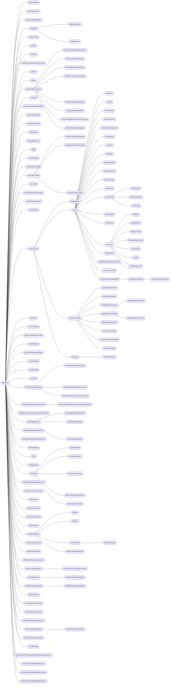

# NSObject

```mermaid
flowchart LR
    A([NSObject]) --- A1([UIAcceleration])
    A --- A3([UlAccelerometer])
    A --- A4([UIAccessibilityElement])
    A --- A5([UIBarltem])
    A --- A6([UIBezierPath])
    A --- A7([UIColor])
    A --- A8([UIDevice])
    A --- A9([UIDocumentinteractionController])
    A --- A10([UlEvent])
    A --- A11([UIFont])
    A --- A12([UIGestureRecognizer])
    A --- A13([Ullmage])
    A --- A14([UILocalizedIndexedCollation])
    A --- A15([UILocalNotification])
    A --- A16([UIMenuController])
    A --- A17([UIMenuItem])
    A --- A18([UINavigationitem])
    A --- A19([UINib])
    A --- A20([UIPasteboard])
    A --- A21([UIPopoverController])
    A --- A22([UIPrintFormatter])
    A --- A23([UIPrintinfo])
    A --- A24([UIPrintinteractionController])
    A --- A25([UIPrintPageRenderer])
    A --- A26([UIPrintPaper])
    A --- A27([UIResponder])
    A --- A28([UIScreen])
    A --- A29([UIScreenMode])
    A --- A30([UISearchDisplayController])
    A --- A31([UITextChecker])
    A --- A32([UITextinputStringTokenizer])
    A --- A33([UITextPosition])
    A --- A34([UITextRange])
    A --- A35([UITouch])
    A --- A36([UICollectionViewLayout])
    A --- A37([UICollectionViewLayoutAttributes])
    A --- A38([UICollectionViewLayoutInvalidationContext])
    A --- A39([UIBarAppearance])
    A --- A40([UIBarButtonItemAppearance])
    A --- A41([UIBarButtonItemStateAppearance])
    A --- A42([URLResponse])
    A --- A43([Timer])
    A --- A44([FileManager])
    A --- A45([Formatter])
    A --- A46([UITabBarItemStateAppearance])
    A --- A47([URLSessionConfiguration])    
    A --- A48([URLSession])
    A --- A49([URLSessionTask])
    A --- A50([NSLayoutConstraint])
    A --- A51([UIAlertAction])
    A --- A52([UIMenuElement])
    A --- A53([UIScreenshotService])
    A --- A54([UIContextualAction])
    A --- A55([UISwipeActionsConfiguration])
    A --- A56([UIFocusUpdateContext])
    A --- A57([UIDropProposal])
    A --- A58([UITableViewPlaceholder])
    A --- A59([UIMenuSystem])
    A --- A60([UIContextMenuInteracion])
    A --- A61([NSCollectionLayoutSize])
    A --- A62([NSCollectionLayoutDimension])
    A --- A63([NSCollectionLayoutItem])
    A --- A64([NSCollectionLayoutSection])
    A --- A65([NSIndexPath])
    A --- A66([UICollectionViewCompositionalLayoutConfiguration])
    A --- A67([UITableViewDiffableDataSource])
    A --- A68([UICollectionViewDiffableDataSource])
    A --- A69([NSCollectionViewDiffableDataSource])

    A5 --- A5-1([UIBarButtonItem])
    A5 --- A5-2([UITabBaritem])

    A12 --- A12-1([UILongPressGestureRecognizer])
    A12 --- A12-2([UIPanGestureRecognizer])
    A12 --- A12-3([UIPinchGestureRecognizer])
    A12 --- A12-4([UIRotationGestureRecognizer])
    A12 --- A12-5([UISwipeGestureRecognizer])
    A12 --- A12-6([UITapGestureRecognizer])
    A12 --- A12-7([UIScreenEdgePanGestureRecognizer])
    A12 --- A12-8([UIHoverGestureRecognizer])

    A22 --- A22-1([UISimpleTextPrintFormatter])
    A22 --- A22-2([UIMarkupTextPrintFormatter])
    A22 --- A22-3([UIViewPrintFormatter])

    A27 --- A27-1([UlApplication])
    A27 --- A27-2([UView])
    A27 --- A27-3([UIViewController])
    A27 --- A27-4([UIScene])

    A27-2 --- A27-2-1([UiWindow])
    A27-2 --- A27-2-2([UILabel])
    A27-2 --- A27-2-3([UIPickerView])
    A27-2 --- A27-2-4([UIProgressView])
    A27-2 --- A27-2-5([UIActivityIndicatorVlew])
    A27-2 --- A27-2-6([UIImageView])
    A27-2 --- A27-2-7([UITabBar])
    A27-2 --- A27-2-8([UIToolbar])
    A27-2 --- A27-2-9([UINavigationBar])
    A27-2 --- A27-2-10([UITableViewCell])
    A27-2 --- A27-2-11([UIActionSheet])
    A27-2 --- A27-2-12([UIAlertView])
    A27-2 --- A27-2-13([UIScrollView])
    A27-2 --- A27-2-14([UISearchBar])
    A27-2 --- A27-2-15([UIWebView])
    A27-2 --- A27-2-16([UIControl])
    A27-2 --- A27-2-17([UIStackView])
    A27-2 --- A27-2-18([UITableViewHeaderFooterView])
    A27-2 --- A27-2-19([UIListContentView])
    A27-2 --- A27-2-20([UICollectionReusableView])
    
    A27-2-13 --- A27-2-13-1([UITableView])
    A27-2-13 --- A27-2-13-2([UICollectionView])
    A27-2-13 --- A27-2-13-3([UITextView])

    A27-2-16 --- A27-2-16-1([UIButton])
    A27-2-16 --- A27-2-16-2([UIDatePicker])
    A27-2-16 --- A27-2-16-3([UIPageControl])
    A27-2-16 --- A27-2-16-4([UISegmentedControl])
    A27-2-16 --- A27-2-16-5([UITextField])
    A27-2-16 --- A27-2-16-6([UISlider])
    A27-2-16 --- A27-2-16-7([USwitch])
    A27-2-16 --- A27-2-16-7([UIRefreshControl])
    
    A27-2-20 --- A27-2-20-1([UICollectionViewCell])

    A27-2-20-1 --- A27-2-20-1-1([UICollectionViewListCell])
    
    A27-3 --- A27-3-1([UISplitViewController])
    A27-3 --- A27-3-2([UITabBarController])
    A27-3 --- A27-3-3([UITableViewController])
    A27-3 --- A27-3-4([UINavigationController])
    A27-3 --- A27-3-5([UIPageViewController])
    A27-3 --- A27-3-6([UISearchController])
    A27-3 --- A27-3-7([UICollectionViewController])
    A27-3 --- A27-3-8([UIAlertController])
    
    A27-3-4 --- A27-3-4-1([UIImagePickerController])
    A27-3-4 --- A27-3-4-2([UIVideoEditorController])
    
    A27-4 --- A27-4-1([UIWindowScene])
    
    A36 --- A36-1([UICollectionViewFlowLayout])
    A36 --- A36-2([UICollectionViewTransitionLayout])
    A36 --- A36-3([UICollectionViewCompositionalLayout])
    
    A37 --- A37-1([UICollectionViewFlowLayoutInvalidationContext])
    
    A39 --- A39-1([UINavigationBarAppearance])
    A39 --- A39-2([UITabBarAppearance])
    A39 --- A39-3([UIToolbarAppearance])
    
    A45 --- A45-1([DateFormatter])
    A45 --- A45-2([NumberFormatter])
    A45 --- A45-3([ByteCountFormatter])
    A45 --- A45-4([DateComponentsFormatter])
    A45 --- A45-5([DateIntervalFormatter])
    
    A52 --- A52-1([UIMenu])
    A52 --- A52-2([UIAction])
    A52 --- A52-3([UICommand])
    A52 --- A52-4([UIDeferredMenuElement])
    
    A52-3 --- A52-3-1([UIKeyCommand])
    
    A56 --- A56-1([UITableViewFocusUpdateContext])
    
    A57 --- A57-1([UITableViewDropProposal])
    
    A58 --- A58-1([UITableViewDropPlaceholder])
    
    A63 --- A63-1([NSCollectionLayoutGroup])
```
